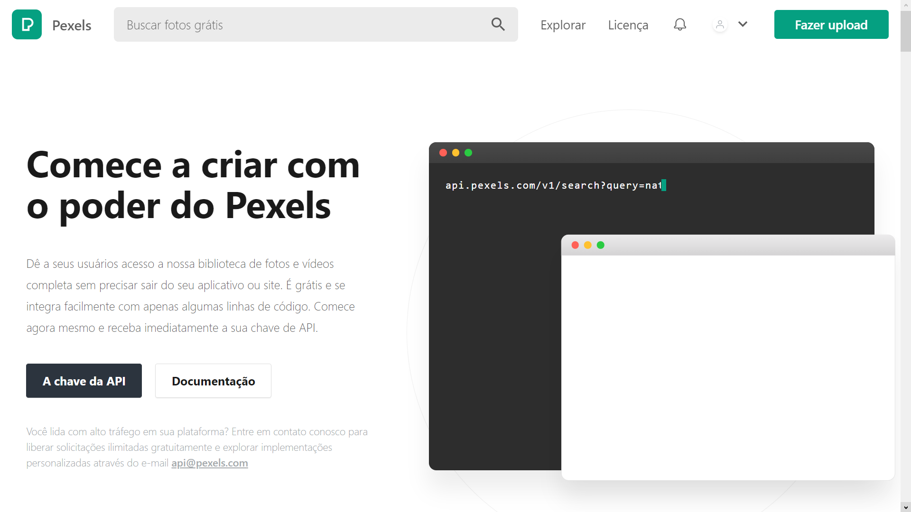

# Projeto: 💎 Fazer uma solicitação GET usando fetch para obter fotos

✨ Para esse projeto, foi usada a [API de Fotos e Vídeos do Pexels](https://www.pexels.com/pt-br/api/).

## 🙂 Tela inicial do aplicativo

## 😎 API funcionado no aplicativo

### Requisição GET

☑️ Todos as imagens foram carregadas com sucesso.

## 💝 Gratidão

- Envie para outras pessoas 📧
- Muito obrigado 👋😎

---

Criado com ❤️ por [Mateus Araújo](https://github.com/mateusaraujos) 😁
